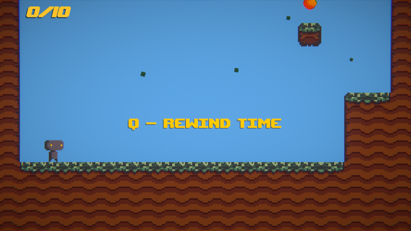

<h1 align="center">
 
Shadow Adventure
</h1>

<h3 align="center"><a href="https://www.boisestate.edu/gimm/">GIMM</a> 110 - Interactive Programming </h3>
<h5 align="center"><a href="https://www.boisestate.edu/">Boise State University</a> (Fall 2022) </h5>

<h4 align="center">A quick platformer that challenges the player to jump and dash to collect the orbs necessary to progress to the next level.</h4>

  <a href="#project-overview">Project Overview</a> •
  <a href="#technical-stack">Technical Stack</a> •
  <a href="#collaborators">Collaborators</a> •
  <a href="#contact">Contact</a>

## Project Overview

As Shadow Adventure was my first experience with game development, I wanted to focus on basing levels around different mechanics. Although the goal of each level is the same, the means for achieving said goal changes, challenging the player to constantly adjust their approach.

#### Level Mechanics:

* <strong>Rewind Time:</strong> Mistakes become opportunities as you manipulate the clock to erase your mistakes and conquer seemingly impossible obstacles.
* <strong>Double Jump:</strong> Leap through the air with grace and finesse, reaching heights and distances that were once out of reach.
* <strong>Dash:</strong> Execute swift bursts of movement, propelling yourself forward to surpass large gaps and navigate through intricate obstacles.
* <strong>Freeze Moving Blocks:</strong> With the power to manipulate the environment, you'll strategically halt obstacles in their path, creating safe passages.

## Technical Stack

 

## Collaborators

<h3>Carson Strout:</h3>

Designer • Programmer • Artist

## Contact

<h3>Carson Strout</h3>

 
 
